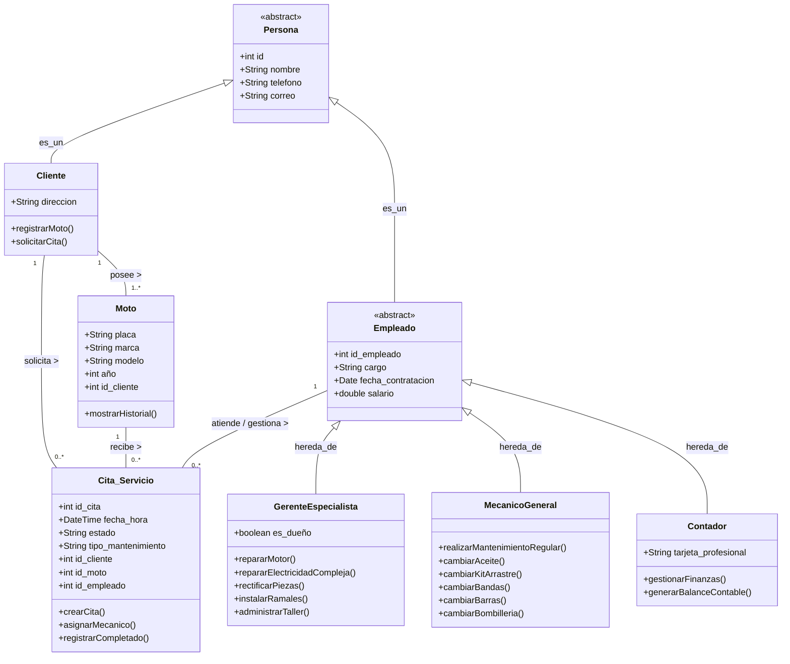

# 📊 Diagrama UML de Clases - Eki-Motos

A continuación se muestra el modelo de clases para el sistema del taller.

```mermaid
classDiagram
    class Persona {
        <<abstract>>
        +int id
        +String nombre
        +String telefono
        +String correo
    }

    class Empleado {
        <<abstract>>
        +int id_empleado
        +String cargo
        +Date fecha_contratacion
        +double salario
    }

    class Cliente {
        +String direccion
        +registrarMoto()
        +solicitarCita()
    }

    class GerenteEspecialista {
        +boolean es_dueño
        +repararMotor()
        +repararElectricidadCompleja()
        +rectificarPiezas()
        +instalarRamales()
        +administrarTaller()
    }

    class MecanicoGeneral {
        +realizarMantenimientoRegular()
        +cambiarAceite()
        +cambiarKitArrastre()
        +cambiarBandas()
        +cambiarBarras()
        +cambiarBombilleria()
    }

    class Contador {
        +String tarjeta_profesional
        +gestionarFinanzas()
        +generarBalanceContable()
    }

    class Moto {
        +String placa
        +String marca
        +String modelo
        +int año
        +int id_cliente
        +mostrarHistorial()
    }

    class Cita_Servicio {
        +int id_cita
        +DateTime fecha_hora
        +String estado
        +String tipo_mantenimiento
        +int id_cliente
        +int id_moto
        +int id_empleado
        +crearCita()
        +asignarMecanico()
        +registrarCompletado()
    }

    Persona <|-- Cliente : es_un
    Persona <|-- Empleado : es_un
    Empleado <|-- GerenteEspecialista : hereda_de
    Empleado <|-- MecanicoGeneral : hereda_de
    Empleado <|-- Contador : hereda_de

    Cliente "1" -- "1..*" Moto : posee >
    Cliente "1" -- "0..*" Cita_Servicio : solicita >
    Moto "1" -- "0..*" Cita_Servicio : recibe >
    Empleado "1" -- "0..*" Cita_Servicio : atiende / gestiona >
```